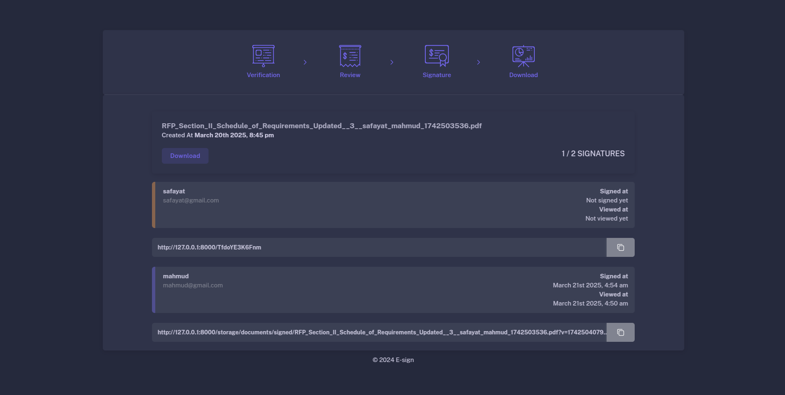

# E-Signature

E-Signature is a digital document signing system where a sender can upload a document, add signers, and send invitations. Signers can then log in and add their digital signatures to the PDF document.

## Features
- Upload documents for e-signing.
- Add multiple signers to a document.
- Send email invitations to signers.
- Sign documents digitally through the web interface.
- Secure and efficient document handling.

## Installation

### Clone the Repository
```bash
git clone https://github.com/S4F4Y4T/E-Signature.git
cd E-Signature
```

### Install Dependencies
```bash
composer install
npm install
```

### Install Required Extensions
Ensure you have PHP 8 or higher installed along with the following PHP extensions for FPDI support:
```bash
sudo apt-get install php-gd php-mbstring php-xml php-bcmath
```

### Set Up Storage Link
```bash
php artisan storage:link
```

### Configure Environment
Copy the `.env.example` file to `.env` and update the database and mail server configurations.
```bash
cp .env.example .env
```

### Import Postman Collection
1. Open Postman.
2. Import the provided Postman collection.
3. Upload a document via Postman.
4. Signers will receive an email invitation to sign the document.

## Demo Screenshots
Below are some screenshots from the application:





## License
This project is licensed under the MIT License.

## Contribution
Feel free to fork the repository and submit pull requests to enhance the functionality.
